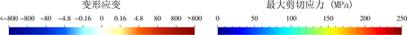

.. _add_del:

有沉积剥蚀
==========

.. _add_del_process:

流程解析
--------

.. warning::

    此节仅为了帮助用户理解应力应变计算过程，用户仍需要 Slurm 作业调度系统( :ref:`slurm` )提交计算，具体方法见  :ref:`ex_strain_stress` 。 

初始目录结构：

::

    |-- ex_strain_stress
        |-- push_add_del.py

``push_add_del.py`` 见  :ref:`ex_strain_stress`

如果有沉积剥蚀过程，需要仔细选择沉积剥蚀的临界文件，详细的流程如下：

 
**所有操作均在 ex_strain_stress 目录下操作**

1. ``zdem push_add_del.py``   
    计算完成，将生成 ``./data`` 文件夹。目录结构如下：
    
    ::

        |-- ex_strain_stress
            |-- push_add_del.py
            |-- data
                |--  all_0000000000_ini.dat
                |--  ...    
                |--  all_0000005000.dat    
                |--  all_0000058000_ini.dat
                |--  all_0000108000.dat    
    
2. ``zdem2jpg --dir=./data``   
    生成jpg，生成计算过程图．注意：这里，只需指定 ``--dir`` ，不加其它任何参数．
    目录结构如下 
    
    ::

        |-- ex_strain_stress
            |-- push_add_del.py
            |-- data
                |--  all_0000000000_ini.dat
                |--  all_0000000000_ini.jpg
                |--  ...    
                |--  all_0000005000.dat
                |--  all_0000005000.jpg
                |--  all_0000058000_ini.dat
                |--  all_0000058000_ini.jpg
                |--  all_0000108000.dat
                |--  all_0000108000.jpg
    
3. 新建datass文件夹，根据jpg挑选需要计算应力应变的.dat文件，复制到datass文件夹中。  
    这里，挑选原则如下：

    - 刚沉积完，并给定颜色，准备挤压的初始模型，必须。all_0000006000_ini.dat
        .. figure:: all_0000006000_ini.jpg
          :width: 100%
          :align: center
    - 刚剥蚀完，准备挤压的模型，必须。all_0000036000_ini.dat
        .. figure:: all_0000036000_ini.jpg
          :width: 100%
          :align: center
    - 沉积稳定，准备挤压前的模型。all_0000058000_ini.dat
        .. figure:: all_0000058000_ini.jpg
          :width: 100%
          :align: center
    - 沉积过程不要，其它的可酌情选取。
    
        目录结构如下 
    
    ::

        |-- ex_strain_stress
            |-- push_add_del.py
            |-- data
                |--  all_0000000000_ini.dat
                |--  all_0000000000_ini.jpg
                |--  ...    
                |--  all_0000005000.dat
                |--  all_0000005000.jpg
                |--  all_0000058000_ini.dat
                |--  all_0000058000_ini.jpg
                |--  all_0000108000.dat
                |--  all_0000108000.jpg
            |-- datass
                |-- all_0000006000_ini.dat
                |-- all_0000026000.dat
                |-- all_0000036000_ini.dat
                |-- all_0000056000.dat
                |-- all_0000058000_ini.dat
                |-- all_0000078000.dat
                |-- all_0000108000.dat
            
4. ``zdem --xmove -1000.0 --ymove -1000.0 --addball --delball -s ./datass``
    计算应力和应变。基于步骤2，我们知道 ``--xmove --ymove`` 应该设置为 ``-1000.0`` ， 并且有沉积 ``--addball`` 和剥蚀 ``--delball`` 过程。
    
    .. note::
        ``zdem`` 命令详解见 :ref:`zdem` ，或者输入 ``zdem -h`` 查看帮助文档。

    计算完成，将生成 ``./datass/ss/data/*.out`` ，供GMT绘图用。目录结构如下 
    
    ::

        |-- ex_strain_stress
            |-- push_add_del.py
            |-- data
                |--  all_0000000000_ini.dat
                |--  all_0000000000_ini.jpg
                |--  ...    
                |--  all_0000005000.dat
                |--  all_0000005000.jpg
                |--  all_0000058000_ini.dat
                |--  all_0000058000_ini.jpg
                |--  all_0000108000.dat
                |--  all_0000108000.jpg
            |-- datass
                |--ss
                   |-- data
                       |-- *.out
                |-- all_0000006000_ini.dat
                |-- all_0000026000.dat
                |-- all_0000036000_ini.dat
                |-- all_0000056000.dat
                |-- all_0000058000_ini.dat
                |-- all_0000078000.dat
                |-- all_0000108000.dat
    
5.  ``zdemss --dir ./datass  --addball ON --delball ON --xmax 40.0 --ymax 10.0 --maxstress 250.0``  
    使用GMT绘制应力应变。``zdemss`` 将会读取 ``zdem`` 生成的应力应变数据 ``./datass/ss/data``，生成应力应变云图到 ``./datass/ss/*jpg`` 。设置x轴最大值 40.0 km，设置y轴最大值 10.0 km，设置颜色条应力最大值250 MPa。
    

    .. note::
        ``zdemss`` 命令详解见 :ref:`zdemss` ，或者输入 ``zdemss -h`` 查看帮助文档。
        
    运行完成之后，目录结构：
        
    ::

        |-- ex_strain_stress
            |-- push_add_del.py
            |-- data
                |--  all_0000000000_ini.dat
                |--  ...    
                |--  all_0000005000.dat    
                |--  all_0000058000_ini.dat
                |--  all_0000108000.dat    
            |-- datass
                |-- ss
                    |-- data
                        |-- *.out
                    |-- ps
                       |-- *.ps
                    |-- tmp
                        |-- *.grd
                    |-- *.jpg
                |-- all_0000006000_ini.dat
                |-- all_0000026000.dat

    - ``./datass/ss/data/*.out`` 应力应变原始数据
    - ``./datass/ss/ps/*.ps``  **输出的应力应变图(矢量图)**
    - ``./datass/ss/tmp/*.grd`` 计算应力应变产生的中间数据
    - ``./datass/ss/*.jpg`` **输出的应力应变图(位图)**

.. _ex_strain_stress:

实例
----

1. ``sbatch jobs1.sh`` 提交，将完成 :ref:`add_del_process` 1和2
2. **此步最关键!** 新建datass文件夹，将需要处理的dat复制到datass文件夹，完成 :ref:`add_del_process` 3。完成此步后，目录结构：

    ::

        |-- ex_strain_stress
            |-- job1.sh
            |-- job2.sh
            |-- push_add_del.py
            |-- data
                |--  all_0000000000_ini.dat
                |--  all_0000001000.dat    
                |--  ...    
                |--  all_0000005000.dat    
                |--  all_0000005000_ini.dat
                |--  all_0000006000.dat    
                |--  all_0000006000_ini.dat
                |--  all_0000016000.dat    
                |--  all_0000026000.dat    
                |--  all_0000036000.dat    
                |--  all_0000036000_ini.dat
                |--  all_0000046000.dat    
                |--  all_0000056000.dat    
                |--  all_0000056000_ini.dat
                |--  all_0000056100.dat    
                |--  ...
                |--  all_0000057900.dat    
                |--  all_0000058000.dat    
                |--  all_0000058000_ini.dat
                |--  all_0000068000.dat    
                |--  all_0000078000.dat    
                |--  all_0000088000.dat    
                |--  all_0000098000.dat    
                |--  all_0000108000.dat    
            |-- datass
                |-- all_0000006000_ini.dat
                |-- all_0000026000.dat
                |-- all_0000036000_ini.dat
                |-- all_0000056000.dat
                |-- all_0000058000_ini.dat
                |-- all_0000078000.dat
                |-- all_0000108000.dat
3. ``sbatch jobs2.sh`` 提交，将完成 :ref:`add_del_process` 4和5。等待计算完成，生成的应力应变图见 ``./datass/ss/*jpg`` 。

  
.. figure:: all0000108000.jpg
  :width: 60%
  :align: center

  **处理结果示意图**

``job1.sh`` ``job2.sh`` ``push_add_del.py`` 文件内容：

``job1.sh``

.. literalinclude::  job1.sh

``job2.sh``

.. literalinclude::  job2.sh

``push_add_del.py``

.. literalinclude::  push_add_del.py

