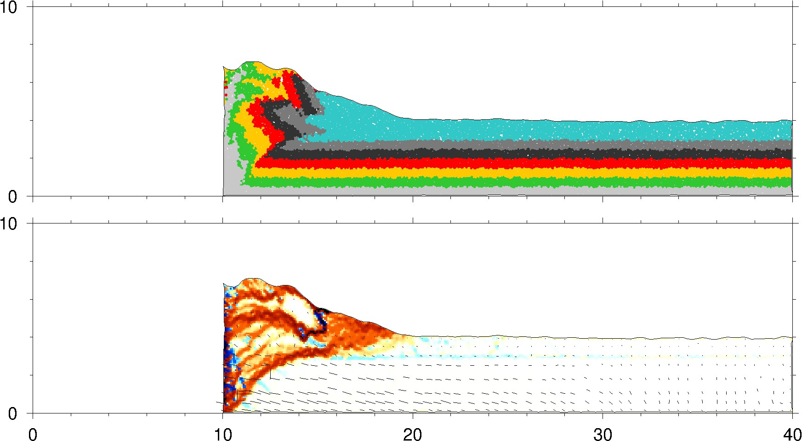

.. _plot_sigma1:

绘制最大主应力矢量
==================

接上节 :ref:`add_del` 实例 ``ex_strain_stress`` ，完成步骤1、2、3和4，之后， :ref:`zdem` 将生成 ``./datass/ss/data/*.out`` ，供GMT绘图用。目录结构如下 
    
    ::

        |-- ex_strain_stress
            |-- push_add_del.py
            |-- data
                |--  all_0000000000_ini.dat
                |--  all_0000000000_ini.jpg
                |--  ...    
                |--  all_0000005000.dat
                |--  all_0000005000.jpg
                |--  all_0000058000_ini.dat
                |--  all_0000058000_ini.jpg
                |--  all_0000108000.dat
                |--  all_0000108000.jpg
            |-- datass
                |--ss
                   |-- data
                       |-- *.out
                |-- all_0000006000_ini.dat
                |-- all_0000026000.dat
                |-- all_0000036000_ini.dat
                |-- all_0000056000.dat
                |-- all_0000058000_ini.dat
                |-- all_0000078000.dat
                |-- all_0000108000.dat

第5步中可以绘制最大主应力矢量。

5. ``zdemss --dir ./datass --strainvol OFF --stressshear ON --sigma1 ON --scale 1.0 --gridsize 600.0 --stressmean OFF --stressshear OFF --addball ON --delball ON --xmax 40.0 --ymax 10.0`` 
    使用GMT绘制最大主应力矢量，叠加在变形应变[stressshear]上。``zdemss`` 将会读取 ``zdem`` 生成的应力应变数据 ``./datass/ss/data``，生成应力应变云图到 ``./datass/ss/*jpg`` 。设置x轴最大值 40.0 km，设置y轴最大值 10.0 km。 
    
    - ``--sigma1 ON`` 绘制最大主应力矢量 ，注意 ``--scale 1.0 --gridsize 600.0`` 是 ``--sigma1`` 的子参数，如打算修改 ``scale`` 或者 ``gridsize`` 的值， 必须跟在 ``--sigma1`` 后，不可随意调换参数位置。
    - ``--scale 1.0`` 最大主应力矢量缩放系数，该值越大，矢量越长，大小用户可以根据出图效果自主调节。默认1.0
    - ``--gridsize 600.0`` 计算最大主应力均值的正方形边长大小，该值越大，矢量稀疏，大小用户可以根据出图效果自主调节。默认600.0，可以尝试修改为1000.0看看效果。
    
    
    
    .. note::
        参数详解见 :ref:`zdemss` 。  
        如果 ``scale`` ``gridsize`` 等参数均采用默认值，则可用采用以下命令绘制最大主应力矢量：
        ``zdemss --dir ./datass --sigma1 ON --addball ON --delball ON`` 
        
    运行完成之后，目录结构：
        
    ::

        |-- ex_strain_stress
            |-- push_add_del.py
            |-- data
                |--  all_0000000000_ini.dat
                |--  ...    
                |--  all_0000005000.dat    
                |--  all_0000058000_ini.dat
                |--  all_0000108000.dat    
            |-- datass
                |-- ss
                    |-- data
                        |-- *.out
                        
                    |-- data2ps
                        |-- strain*.out
                        |-- stress*.out
                    |-- ps
                       |-- *.ps
                    |-- Tmp
                        |-- *.grd
                    |-- *.jpg
                |-- all_0000006000_ini.dat
                |-- all_0000026000.dat

    - ``./datass/ss/data/*.out`` :ref:`zdem` 输出的颗粒位置和(假)应力的原始数据
    - ``./datass/ss/data2ps/*.out``   (真)应力应变数据，用于绘制应力应变图(ps)，用户可以用于定量分析
    - ``./datass/ss/ps/*.ps``  **输出的应力应变图(矢量图)**
    - ``./datass/ss/Tmp/*.grd`` 计算应力应变产生的中间数据
    - ``./datass/ss/*.jpg`` **输出的应力应变图(位图)**

    输出的最大主应力矢量见下图：

  

  **最大主应力矢量，叠加在变形应变图上**
