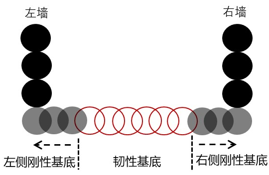
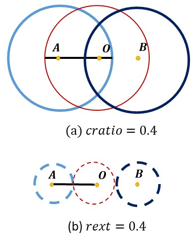
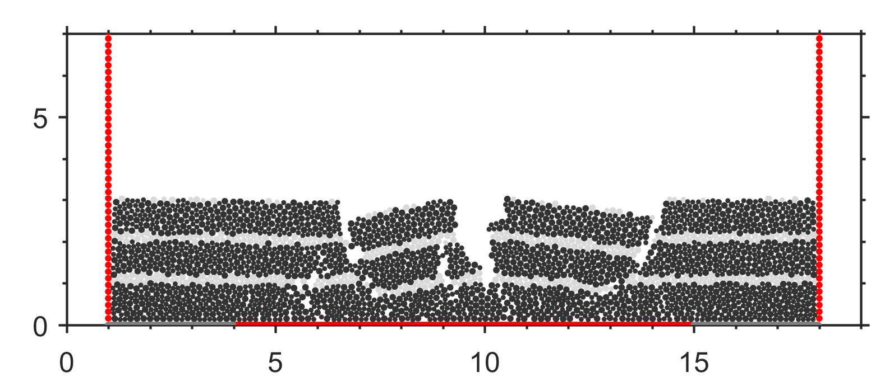

韧性基底 伸展构造
=================

这里是一个 ``韧性基底 伸展构造`` 设置的实例，基底由左右两个刚性墙和中间的韧性墙组成。
 
**粘结时，设置临时半径缩放系数等于初始叠合率，避免出现跨颗粒粘结情况发生**，详细描述见发明专利： 

`李长圣,尹宏伟,吴珍云,等.一种基于离散元的裂谷盆地伸展过程模拟方法[P].江西省：CN111008472B,2023-11-21. <https://kns.cnki.net/kcms2/article/abstract?v=Skeo7MzZydbnlVpkrvNpcHaAaho85ENh5lMs7Wo_-jAc8-dZK0ruYCsA6mSgArEyp_YTsYMNtXzyxpikL8ui74_4-AZtLg58Nxrba3X6a-kR-IT41BiuSQbUO8eh7WPV&uniplatform=NZKPT&flag=copy>`_ 

  
- 初始叠合率 :math:`cratio=|AO|/(r_A+r_O)` , 即圆心距离( :math:`|AO|` )与平衡距离( :math:`r_A+r_O` )的比值

.. figure:: cratio.png
  :width: 40%
  :align: center

- 临时半径缩放系数 :math:`r_{ext}=r_{tmp}/r_{old}`

  
``extens_ductile_patent.py`` 中内容如下：

.. literalinclude:: extens_ductile_patent.py

计算结束后，将得到以下结果：

.. figure:: all_0000015001.png
  :width: 60%
  :align: center

.. figure:: all_0000030001.png
  :width: 60%
  :align: center

.. figure:: all_0000041000.png
  :width: 60%
  :align: center

.. figure:: all_0000046001.png
  :width: 60%
  :align: center

  **单位(km)**

